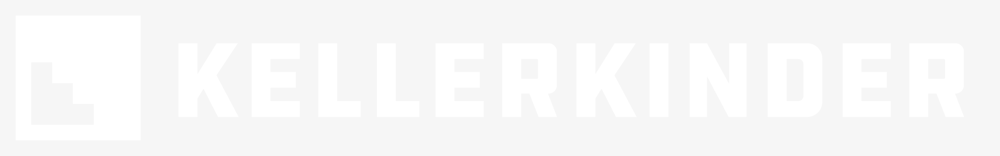

    

## 
Inspire. Everyday.

     
     
     
     

 

<pre align="center">
    Die Kellerkinder stehen für 100% Shopware. 
    Agenturen und Integratoren holen uns bei komplexen Projekten dazu.
    Für Consulting, Konzeption & Plugin-Entwicklung.
</pre>

## Was wir machen

> Grobe Darstellung unserer Arbeit (mit Shopware).
> Eventuell coole Open-Source-Projekte von uns verlinken.

## Wir suchen Dich!

Wir lieben, was wir tun.
Nicht umsonst heißt unser Credo "Qualität ist der beste Businessplan".
Und deshalb haben wir uns auch auf Shopware spezialisiert.
Keine anderen Projekte, pures Shopware mit Vue.js-/ExtJS- und (Frontend-) Erweiterungen sowie Anbindungen von externen
Systemen.

Und dafür brauchen wir Verstärkung!

* [Technical Architect (m/w/d)](https://kellerkinder.jobs.personio.de/job/386720)
* [Shopware Backend-Developer (m/w/d)](https://kellerkinder.jobs.personio.de/job/386712)
* Oder vielleicht was [ganz anderes](https://www.kellerkinder.de/jobs)?

## Kommende Events

Du kannst uns auf verschiedenen Events, Konferenzen oder Meetups treffen. Eine aktuelle Übersicht haben wir auf [unserer Webseite](https://kellerkinder.de/events).
